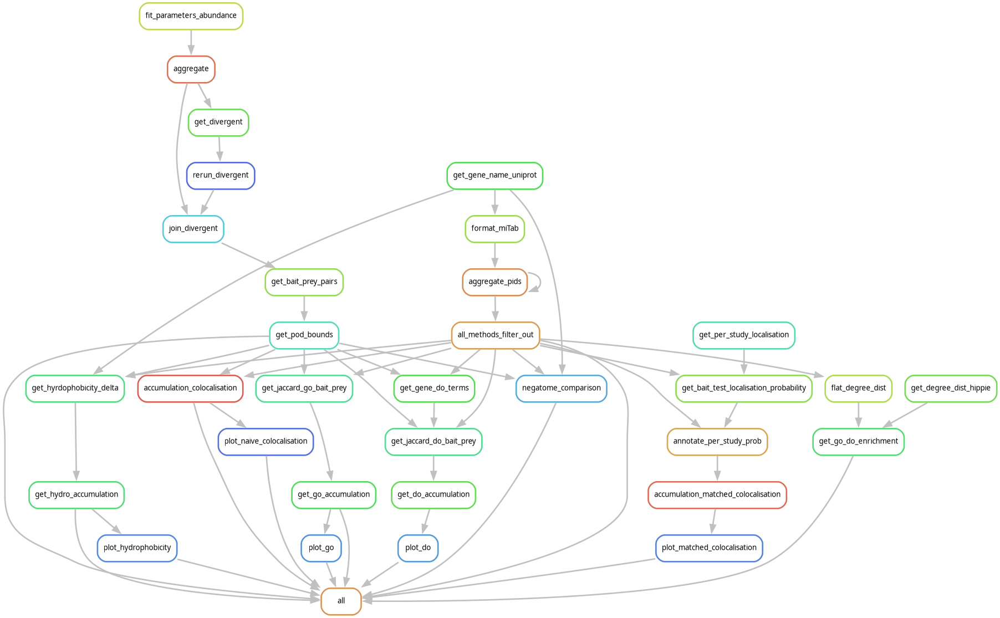

## Introduction
This repository contains analysis for inference of non-interaction data using [Intact](https://www.ebi.ac.uk/intact/interactomes). Using this non-interaction data, high confidence non-interaction bait-prey protein pairs can be obtained based on their replication rate.

The [Snakemake](https://snakemake.github.io/) workflow is as follows:




## Output of note:
- Scored interactions
  - `"work_folder/{project}/analysis/POD/POD_{dataset}.csv"`
    - Columns:
      - `{id_pattern}_bait`: Gene name/uniprot ID for bait 
      - `{id_pattern}_prey`: Gene name/uniprot ID for prey
      - `n_tested`: Number of tests inferred 
      - `n_observed`: Number of interactions observed
      - `pubmed_id`: Identifying combination of method and pubmed ID on form `"{pubmed_id1}_{method1};{pubmed_id2}_{method2}"` where test where made
      - `cl_id`: None or cell line IDs provided in `cell_line_ppis`
      - `alpha_post`: Updated alpha value for beta distribution 
      - `beta_post`: Updated beta value for beta distribution
      - `p`: Mean probability of detection 
      - `lower_bound_pod`: 2.5 % credibility interval limit of posterior density  
      - `upper_bound_pod`: 97.5 % credibility interval limit of posterior density
  - Datasets:
    - `y2h`: y2h strategies
    - `ms`: Masspectrometry detecting (excluding BioID/TurboID)
    - `flat`: union of `y2h` and `ms`
    - `MI-1314`: BioID/TurboID
- Comparative statistics:
  - All metrics are reported as a cumulative distribution mean of:
    - Probability of detection > `lower_bound_pod` for `direction=greater`
    - Probability of detection < `upepr_bound_pod` for `direction=lesser`
  - `work_folder/{project}/analysis/localisation/cumulative/POD_{data}_localisation_{direction}.csv`:
    - **global cellular sub-localisation** match rate. Prey localisation probability is calculated on all prey in dataset.
  - `work_folder/{project}/analysis/localisation/study_match_probability/cumulative/POD_{dataset}_localisation_{direction}.csv`:
    - **cellular sub-localisation** match rate. Prey localisation probability is estimated from each study. 
  - `work_folder/{project}/analysis/GO/cumulative/POD_{data}_jaccard_{direction}.csv`: 
    - Gene ontology Jaccard index between bait and prey gene. 
  - `work_folder/inferred_search_space/analysis/bias_reduced_ppis/cell_line/high_confidence.csv`:
    - Low/high cell line prey detectability among HCIs
  - `work_folder/plots/AccumulationPOD/do_{dataset}_jaccard.png`:
    - Disease ontology Jaccard index  


## Config
Parameters are set in `config_files/config.yaml` as:
- `formated_ppi`: Path to formated cell line PPI file
- `cell_line_ppis`: Path to cell line annotated PPI file 
- `remove_single_publications`: Boolean if single PPI studies should be filtered out
- `pseudo_n`: Prior strength for POD probability
- `id_pattern`: Identifiers for bait/prey experiments:
  - `"gene_name"`: Aggregate on gene name 
  - `"uniprot_id"`: Aggregate on uniprot ID   
- `localisation_file`: Path to localisation data 
- `selected_cell_lines`: List of cell lines to aggregate on in cell line aware analysis  
- `ms`: list of mass spectrometry detection methods 
- `y2h`: list of yeast 2 hybrid methods

## Setup
### Data
**Subcellular localisation**: Human protein atlas
```commandline
wget https://www.proteinatlas.org/download/tsv/subcellular_location.tsv.zip -P data/localisation/
unzip data/localisation/subcellular_location.tsv.zip -d data/localisation/
```

Set `cell_line_ppis` to the output `CL_annotated_bait_prey.csv` from [cell line curated](https://github.com/JoelAAs/Cell_line_curated_PPI). (Not needed if cell line is not considered)
### Conda and R
Make sure to have miniconda or anaconda installed then:
```commandline
conda env create -f envs/snakemake.yml
conda env create -f envs/do_enrichment.yml 
conda activate do_enrichment
Rscript envs/serup_do_enrichment.R
```

## Run
Probability of detection estimates using `uniprot_id` as identifier:
```commandline
conda activate snakemake
snakemake -s SnakeFile_pod.smk -c 5  
```

Run with comparative analysis with `gene_name` as identifier:
```commandline
conda activate snakemake
snakemake -s SnakeFile.smk -c 5  
```